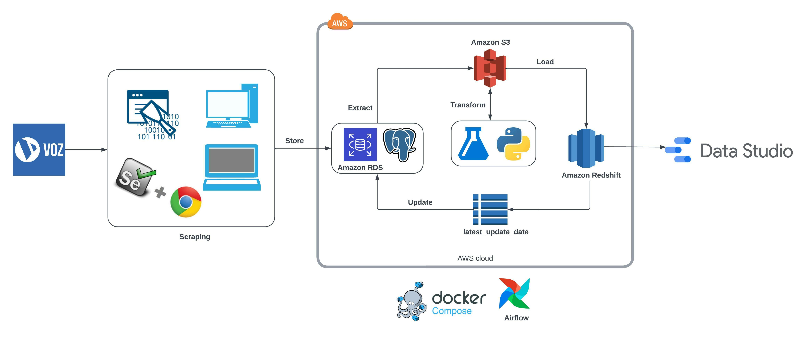
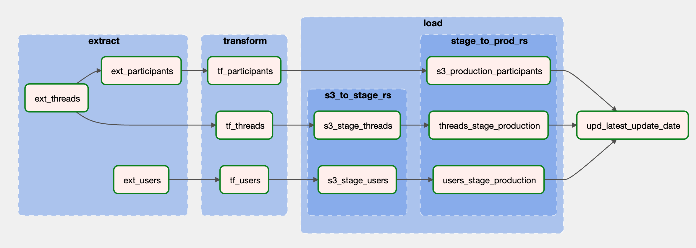
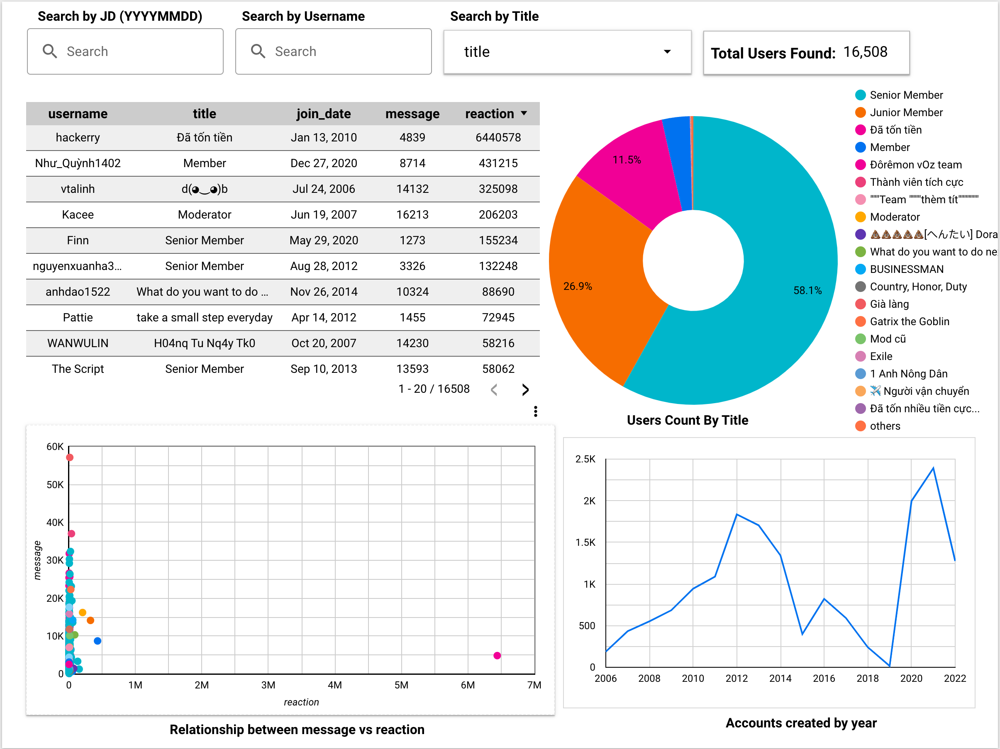

# VOZ Scraper and ETL Data Pipeline

A scraper that scrapes data, mainly threads and users info, from one of the crowded forum in Vietnam, [vOzforum](https://voz.vn). Follow-up is an 
ETL of this data, which migrates data from [Amazon RDS](https://aws.amazon.com/rds/) to [S3 Bucket](https://aws.amazon.com/s3/), then finally landed onto [Redshift](https://aws.amazon.com/redshift/). The end-point of the data is [Google Data Studio](https://datastudio.google.com/) for an auto-update [dashboard](https://datastudio.google.com/reporting/e9e3cdec-2a34-4abd-91a0-930d9db0b531/page/p_pc5udi83xc). <br>
Tech stack: [Selenium Webdriver](https://www.selenium.dev/), Python, [Postgesql](https://www.postgresql.org/), S3 bucket, RDS PostgreSQL database, Redshift data warehouse,
[Docker-compose](https://docs.docker.com/compose/), [Airflow](https://airflow.apache.org/), and Google Data Studio.<br>


At first, I wanted to do an analysis of whether some keywords appearing in the thread title could attract members to throw comments and views. So, I determined to learn how to
scrape a website (I'd never done one before) using Python, and I found selenium somehow. Even though building the scraper took almost 2/3 time of this project, the main purpose
still getting the ETL done. <br>
I build this ETL pipeline to ingest raw data scraped from vOz to RDS PostgreSQL. This data will be loaded to S3 data lake as `.csv` and `.json` files to be later transformed, cleaned and 
finally landed onto my Redshift data warehouse for analytic task. Finally, I use Docker-Airflow to schedule this cycle, lets say once a week ideally.
### [Scraping](src/scrape/scrape_threads.py)
___
In general, I combine selenium webdriver to send request and [Beautiful Soup](https://beautiful-soup-4.readthedocs.io/en/latest/) to parse HTML. <br>

#### [Threads](src/scrape/scrape_threads.py)
___
The heart of this part is getting all `main_threads` per page, which normally are 20, and ignores sticky threads
```python
def scrape_main_threads(url):
    '''Get only main threads, ignore sticky threads'''
    soup = get_source_page(url)
    all_threads = soup.find('div', class_='structItemContainer-group js-threadList')
    main_threads = all_threads.findAll('div', {'data-author': True})

    return main_threads
``` 
Then I extract information from these threads
```python   
def scrape_threads(page_number: int, f=33, ext='', no_of_threads=20):
    """ Extract data of threads from page {page_number} """
    ... 
    main_threads = get_main_threads(url)[:no_of_threads]
    restul = []
    for thread in main_threads:
        ...    
        data = {
            ...
        }        
        ...
        result.append(data) 
    ...
```
#### [Comments](src/scrape/scrape_threads.py)
___
I want to collect all `comments` of some high-replied threads to do word-count on them to figure out what words are likely to occur here.
```python
def analyze_thread(driver):
    # This function does 2 tasks:
    # 1/ Extract all comment information
    # 2/ Get users (comments' authors)  info from tooltip boxes    
    ...
    comments = thread_content.find_all('article', {'class': 'message message--post js-post js-inlineModContainer'})
    for i in range(start_comment, len(comments)):
        comment = comments[i]
        data = {}
        ...
    ...
```
In this function, I also collect how many `loves` and `bricks` (if any) each `comment` received. It is a bit complicated to do it at the same
time since they are wrapped in a link text. I have to use 2 `webdrivers` to complete this task, one `comment_driver` to trigger the tooltip box and one `driver` to collect data. Thus, it takes some time to wait for the drivers done their tasks before moving on.
Through experiments, I have to use a few `try: except:` blocks to combat the workflow between 2 webdrivers <br>

```python
...
comment_drivers = driver.find_elements(By.CSS_SELECTOR,
                                   "article[class='message message--post js-post js-inlineModContainer  ']")
...     
    # This try except used to close the tooltip box of comment's reaction 
    # in case it hasn't been closed due to lagging
    try:
        # Find the tooltip box if available
        driver.find_element(By.CSS_SELECTOR, "div[class='overlay-content']")
        # Send a keystroke to close tooltip box
        action_chain.send_keys(Keys.ESCAPE).perform()
        time.sleep(3)
    except:
        pass
    finally:
        try:
            # Find the link text of reaction
            react_bar = comment_driver.find_element(By.CSS_SELECTOR,
                                                    "a[class='reactionsBar-link']")
            # Move mouse pointer on it and click to open the tooltip box
            action_chain.move_to_element(react_bar).click().perform()
            WebDriverWait(driver, 60).until(
                EC.presence_of_element_located((By.CSS_SELECTOR, "div[class='overlay-container is-active']"))
            )
            # The other driver starts to collect loves and bricks
            try:
                love_raw = driver.find_element(By.CSS_SELECTOR, "a[id='reaction-1']").get_attribute("textContent")
                data['love'] = int(re.sub('\D', '', love_raw))
            except:
                pass
    
            try:
                brick_raw = driver.find_element(By.CSS_SELECTOR, "a[id='reaction-2']").get_attribute("textContent")
                data['brick'] = int(re.sub('\D', '', brick_raw))
            except:
                pass
    
        except:
            pass
...     # Send a keystroke to close tooltip box
        action_chain.send_keys(Keys.ESCAPE).perform()
```
Last but not least in this function is collecting the author info `user_info`. The driver will move to the author name and hover for 1 second to trigger the `tooltip box`, which contains
author's information. When all tooltip boxes have appeared, it is time to collect data.
```python
...
    # Move mouse pointer to author name and hover for 1 second
    elm = comment_driver.find_element(By.CSS_SELECTOR, "h4[class='message-name']").find_element(By.TAG_NAME, 'a')
    action_chain.move_to_element(elm).pause(1).perform()
...
# Get users infor
tooltips = driver.find_elements(By.CSS_SELECTOR, 'div[role="tooltip"]')
user_info = [scrape_user_tooltip_selenium(tooltip) for tooltip in tooltips]
```
#### [Users](src/scrape/scrape_users.py)
___
It is very straightforward in this part, just collect user data from the tooltip box
```python
def scrape_user_tooltip_selenium(tooltip):
    '''Get user info from tooltip box'''
    try:
        u_data = tooltip.find_element(By.CLASS_NAME, "memberTooltip")
    except Exception as e:
        #print(e)
        return None
    data = {}
    ...

    return data
```
### [Storing](src/load/load_data_to_postgresdb.py)
___
All this raw data will be stored in 2 tables `threads` and `users` in RDS Postgresql. I establish the connection to database through the helper function [connect](src/utilities/database_utils.py).
```python
def connect(section=""):
    """ Connect to postgresql or redshift"""
    params = config(section=section)
    print(f'Connecting to section {section}...')
    if section in ['postgresql', 'postgresql_aws']:
        engine = create_engine(
            f'postgresql://{params["user"]}:{params["password"]}@{params["host"]}:5432/{params["database"]}')
    elif section == 'redshift':
        engine = redshift_connector.connect(
            host=params['host'],
            database=params['database'],
            user=params['user'],
            password=params['password'],
            port=int(params['port']),
        )
    else:
        print(f'Connect to section {section} failed...')
        return None

    print(f'{section} connection established!')

    return engine
```
For threads, I send them in a list of dicts then parse this list to json. Then I use the PostgreSQL JSON function [jsonb_populate_recordset](https://www.postgresql.org/docs/9.5/functions-json.html)
to load data into table `threads`. I intentionally store `participants` (list of dicts) and `status` (list) as `JSONB` data type instead of storing these 2 fields in separate tables because I only read/write the whole field
in each query and also not doing any aggregation on them. Thus, I can avoid join query to improve performance and also avoid column order matter.
```python
def load_thread_to_staging(engine, threads_staging, data: dict):
    '''Load thread as a json file into staging table'''
    create_table_threads = f'''DROP TABLE IF EXISTS {threads_staging};
                                CREATE TABLE IF NOT EXISTS {threads_staging} (    
                                    thread_id INT PRIMARY KEY,
                                    title TEXT NOT NULL,
                                    author_name VARCHAR(100) NOT NULL,
                                    author_id INT NOT NULL,
                                    reply_count VARCHAR(10) DEFAULT 0,
                                    view_count VARCHAR(10) DEFAULT 0,
                                    participants JSONB,
                                    created_at TIMESTAMP DEFAULT NOW(),                                                                                                                 
                                    updated_at TIMESTAMP DEFAULT NOW(),
                                    f int,
                                    status JSONB
                                    );
                                '''
    with engine.begin() as conn:
        conn.execute(create_table_threads)        
        query = f'''
                    INSERT INTO {table} SELECT * FROM jsonb_populate_recordset(NULL::{table}, %s);
                    '''
        conn.execute(query, (json.dumps(data),))
        print(f"Loaded {len(data)} rows to table {table} successfully!")
```
Finally, I use staging table to do upsert on the main table
```python
engine = connect("postgresql_aws")
load_thread_to_staging(engine, "threads_staging", a_list_of_dict)
load_thread_staging_to_production(engine, staging_table="threads_staging", prod_table="threads")
```
For users, it is quite normal and nothing special here. I send users data in a `DataFrame` and use function `copy_from()` to load data into table `users`. I also use staging table to do upsert.
```python
def copy_df_to_postgresdb(engine, table: str, df):
    raw_conn = engine.raw_connection()
    cur = raw_conn.cursor()
    buffer = StringIO()
    df.to_csv(buffer, header=False, index=False, sep='\t')
    buffer.seek(0)
    try:
        cur.copy_from(buffer, table, sep='\t', null='')
        raw_conn.commit()
        print(f"Copied {df.shape[0]} rows into table {table} successfully!")
    except Exception as e:
        print(e)
    finally:
        cur.close()
        raw_conn.close()
```
```python
def load_user_to_staging(engine, table: str, df):
        '''Load users data as a DataFrame into staging table'''
        create_table = f''' 
        DROP TABLE IF EXISTS {table};
        CREATE TABLE {table} (    
                                user_id INT PRIMARY KEY,  
                                username VARCHAR(100) NOT NULL,
                                title VARCHAR(100) NOT NULL,
                                location VARCHAR(100),
                                join_date DATE NOT NULL,
                                last_seen TIMESTAMP DEFAULT NOW(),
                                message INT DEFAULT 0,
                                reaction INT DEFAULT 0,
                                point INT DEFAULT 0,                                                                                                        
                                created_at TIMESTAMP DEFAULT NOW(),
                                updated_at TIMESTAMP DEFAULT NOW()
                                );
        '''
        engine.execute(create_table)
        copy_df_to_postgresdb(engine, table, df)
```
```python
engine = connect("postgresql_aws")
load_user_to_staging(engine, "users_staging", a_df)
load_user_staging_to_production(engine, staging_table="users_staging", prod_table="users")
```
### ETL
___

#### [Data Extraction](src/extract/extract_pg.py)
___
The starting-point of the ETL is unpacking data from RDS PostgreSQL to S3 data lake. On each ingestion, I query the datetime of the last extraction to ignore the old data (already ingested before).
Data is loaded into an S3 Bucket in separate files based on kinds of data, which are `threads`, `participants`, and `users`. 
```python
def extract_threads_pg(pg_engine) -> pd.DataFrame:
    """
    Get the datetime of the last extraction and extract threads after this datetime (new threads)
    Also extract thread_id and participants from threads to create a new DataFrame
    Then upload both DataFrames to S3 Bucket
    """
    latest_update_date = pg_engine.execute("SELECT * FROM latest_update_date").fetchone()
    if latest_update_date:
        threads = f"SELECT * FROM threads WHERE updated_at > '{latest_update_date[0]}'"
    else:
        threads = "SELECT * from threads"
    data = pd.read_sql(threads, pg_engine)

    return data    
```
`participants` will be extracted directly from `threads`
```python
def extract_participants_pg(threads: pd.DataFrame) -> pd.DataFrame:
    return threads[['thread_id', 'participants']]
```
```python
def extract_users_pg(pg_engine) -> pd.DataFrame:
    """
    Get the datetime of the last extraction and extract users after this datetime (new users)
    Then upload to S3 Bucket
    """
    # extraction_date = datetime.now().strftime("%Y%m%d%H%M%S")
    latest_update_date = pg_engine.execute("SELECT * FROM latest_update_date").fetchone()
    if latest_update_date:
        users = f"SELECT * FROM users WHERE updated_at > '{latest_update_date[0]}'"
    else:
        users = "SELECT * from users"
    data = pd.read_sql(users, pg_engine)

    return data    
```
Files will be `gzipped` before landed onto S3 Bucket.
```python
def upload_to_s3(obj, filepath, BUCKET_NAME, AWS_ACCESS_KEY_ID, AWS_SECRET_KEY):
    """
    Upload gzipped object (DataFrame of json) to s3 in the directory {filepath}
    """
    if isinstance(obj, pd.DataFrame):
        str_buffer = StringIO()
        obj.to_csv(str_buffer, index=False,header=True, sep='\t')
        str_buffer.seek(0)
        obj = str_buffer.getvalue()

    buffer = io.BytesIO()
    with gzip.GzipFile(fileobj=buffer, mode='wb') as fh:
        with io.TextIOWrapper(fh, encoding='utf-8') as wrapper:
            wrapper.write(obj)
    buffer.seek(0)
    body = buffer.getvalue()

    s3_client = boto3.client('s3', aws_access_key_id=AWS_ACCESS_KEY_ID, aws_secret_access_key=AWS_SECRET_KEY,)
    s3_client.put_object(Bucket=BUCKET_NAME, Key=filepath, Body=body)
    print(f'Upload {filepath} to s3 successfully!')
```
I use `extraction_date` as the current datetime to name files on S3 Bucket.

```python
extraction_date = datetime.now().strftime("%Y%m%d%H%M%S")
```
For the sake of simplicity, I store all kinds of data in `.csv` file in this phase
```python
fp_p = f'files/participants/raw/{extraction_date}.csv.gz'
fp_t = f'files/threads/raw/{extraction_date}.csv.gz'
fp_u = f'files/users/raw/{extraction_date}.csv.gz'
upload_to_s3(threads, fp_t, S3_BUCKET, S3_ACCESS_KEY, S3_SECKET_KEY)
upload_to_s3(participants, fp_p, S3_BUCKET, S3_ACCESS_KEY, S3_SECKET_KEY)
upload_to_s3(users, fp_u, S3_BUCKET, S3_ACCESS_KEY, S3_SECKET_KEY)
```
#### [Data Transformation](./src/transform/transform.py)
___
In this step, raw data will be pulled off from S3 Bucket and be transformed properly based on kind of data.
##### [Participants](./src/transform/transform.py)
___
There is not much work to do with participants data since it is already cleaned in the scraping stage. However, not all records have participants field (not `NULL`).
So, I have to filter out `NULL` records and then `concat` all `participants` into only one `DataFrame` along with the corresponding `thread_id`. Finally, I filter out duplicated rows then ship them back to S3 Bucket
as cleaned data.
```python
def transform_participants(fp):
    df_participants = get_gzip_s3(S3_BUCKET, fp, S3_ACCESS_KEY, S3_SECKET_KEY)
    participants = df_participants[~df_participants['participants'].isna()]
    new_par_df = None
    # Create DataFrame for participants
    for i, row in participants.iterrows():
        df_par = pd.DataFrame(eval(row['participants']))
        df_par['thread_id'] = row['thread_id']
        df_par = df_par[['thread_id', 'user_id', 'username', 'reply', 'created_at', 'love', 'brick']]
        new_par_df = df_par if new_par_df is None else pd.concat([new_par_df, df_par])
    new_par_df.drop_duplicates(subset=['thread_id', 'user_id', 'created_at'], keep="last", inplace=True)
    # Replce prefix raw to clean in S3 Bucket
    clean_fp = fp.replace("/raw/", "/clean/")
    upload_to_s3(new_par_df, clean_fp, S3_BUCKET, S3_ACCESS_KEY, S3_SECKET_KEY)
```
##### [Users](./src/transform/transform.py)
___
What to do with `users` is almost the same with `participants`, but in instead of doing fancy things, I only replace blank `location` to `"Namek"` and nothing more since users data
has already been deduplicated in [Storing](README.md#[Storing](./load/save_data_to_postgresdb.py)) stage.
```python
def transform_users(fp):
    df_users = get_gzip_s3(S3_BUCKET, fp, S3_ACCESS_KEY, S3_SECKET_KEY)
    # Replace blank location to Namek
    replace_blank_location(df_users)
    for i in ['created_at', 'updated_at', 'last_seen', 'join_date']:
        df_users[i] = df_users[i].astype(str)
    # print(df_users.head())
    clean_fp = fp.replace("/raw/", "/clean/")
    upload_to_s3(df_users, clean_fp, S3_BUCKET, S3_ACCESS_KEY, S3_SECKET_KEY)
```
##### [Threads](./src/transform/transform.py)
___
Raw thread data pulled off from S3 Bucket is a `.csv` file. So, I will put it into a `DataFrame` then start transforming. First, I replace `M` and `K` characters, which represents for 
million and thousand respectively, in 2 columns `view_count` and `reply_count` to number `K = 000` and `M = 000000`. Next, I will do word-count on the `reply` field in the `participants` column. 
The result of this process is a `dict` of `key-value` pairs. Then I assign this `dict` to a new column named `word_count`.<br>
Now it's time to prepare for a shipment, I exclude the `participants` column from the `DataFrame` then parse it to `json`. During the stage loading data to Redshift, I was struggled to figure out
why I couldn't copy my `json` file into Redshift database. So, I looked carefully on this [docs](https://docs.aws.amazon.com/redshift/latest/dg/r_COPY_command_examples.html#r_COPY_command_examples-copy-from-json)
and finally could modify my `json` to match with the `json` pattern of Redshift
```python
def transform_threads(fp):
    df_threads = get_gzip_s3(S3_BUCKET, fp, S3_ACCESS_KEY, S3_SECKET_KEY)
    # Replace M and K in 2 columns view_count and reply_count. M = 000000 and K = 000
    replace_M_K(df_threads)
    # Do word-count on each reply (comment) of a thread then assign result (a dict) in column word_count
    df_threads = df_threads.assign(word_count=lambda x: count_word(x['participants']))
    df_threads['created_at'] = df_threads['created_at'].astype(str)
    df_threads['updated_at'] = df_threads['updated_at'].astype(str)
    cols = df_threads.columns.tolist()
    # Exclude participants column from threads
    new_cols = cols[:6] + cols[7:] + cols[6:7]
    data_json = df_threads[new_cols].to_json(orient="records")
    # Modify the json array to match with JSON pattern of Redshift
    threads_json = data_json[1:-1].replace(',{"thread_id":', '{"thread_id":')

    #print(df_threads[~df_threads['word_count'].isna()]['word_count'])
    clean_fp = fp.replace("/raw/", "/clean/").replace(".csv", ".json")
    upload_to_s3(threads_json, clean_fp, S3_BUCKET, S3_ACCESS_KEY, S3_SECKET_KEY)
```
The word-count process here is pretty straightfordward. It receives the `participants` column as an input then reads row by row. Note that
each row is a list of dicts. So, I put it in a DataFrame then manipulate the `reply` column: remove punctuation, split string into single word, group by word, then count occurrences.
Fianlly store the result in a dict and throw back to the DataFrame
```python
def count_word(reply):
    '''Remove punctuation from reply, split into single word then count occurrences of each word'''
    def count_w(a_list):
        if a_list is None:
            return None
        tmp = pd.DataFrame(a_list)
        # Remove punctuation
        a = tmp['reply'].str.translate(str.maketrans('', '', string.punctuation))
        # Split into single word
        b = a.str.split(expand=True)
        # Group by word
        c = b.stack()
        # Count occurrences
        d = c.value_counts()
   
        return dict(d)        
    # Read each row of participants at a time
    return reply.apply(lambda x: count_w(x))
```
#### [Data Loading](src/load/load_s3_to_redshift.py)
___
Once data is cleaned and loaded into S3 Bucket, it will be loaded into Redshift data warehouse. I also use staging table to do upsert on tables `threads` and `users`. However, I
load data directly from S3 Bucket to table `participants` in production database in Redshift since this data is already deduplicated and each record is completely unique against the table.<br>
It is pretty the same workflow as [Storing](README.md#[Store](./load/save_data_to_postgresdb.py)) stage. However, Redshift has a unique `COPY` query, which is the best way to load file from S3 Bucktet to its database. 
There is one thing a bit different here is I copy threads from a `json` file with [JSONPath](https://docs.aws.amazon.com/redshift/latest/dg/copy-usage_notes-copy-from-json.html#copy-usage-json-options) option.
Also note that filepath in copy query here uses the pattern `s3://bucket_name/prefix`
```python
copy_table = {'threads_staging': f'''
        COPY {table}
        FROM '{filepath}'
        IAM_ROLE '{iam}'        
        JSON 's3://voz-s3-npt/files/threads/jsonpaths.txt'              
        GZIP 
        ACCEPTINVCHARS ' ' 
        TRUNCATECOLUMNS 
        TRIMBLANKS
        ;
    ''', 'participants': f'''
        COPY {table}
        FROM '{filepath}'
        IAM_ROLE '{iam}'                
        IGNOREHEADER 1
        DATEFORMAT 'MON DD, YYYY'
        TIMEFORMAT 'MON DD, YYYY HH:MI:SS AM'        
        DELIMITER '\t'              
        GZIP 
        ACCEPTINVCHARS ' ' 
        TRUNCATECOLUMNS 
        TRIMBLANKS
        ;
    ''', 'users_staging': f'''
        COPY {table}
        FROM '{filepath}'
        IAM_ROLE '{iam}'                
        IGNOREHEADER 1           
        DELIMITER '\t'              
        GZIP 
        ACCEPTINVCHARS ' ' 
        TRUNCATECOLUMNS 
        TRIMBLANKS
        ;
    ''' }
```
When create tables, I define `DISTKEY` for `id` column instead of `PRIMARY KEY` because Redshift does not enforce PK contrains. `DISTKEY` will improve performance of join query. One more thing is
the `SUPER` data type, it is equivalent to `JSON/JSONB` in PostgreSQL
```postgresql
CREATE TABLE participants (...,thread_id INT NOT NULL DISTKEY SORTKEY,...)
CREATE TABLE threads(...,thread_id INT NOT NULL DISTKEY, status SUPER, word_count SUPER ...)
CREATE TABLE users(...,user_id INT NOT NULL DISTKEY,...)
```
Finally, I establish the Redshift connection through [redshift_connector](src/utilities/database_utils.py) library (see [here](https://github.com/aws/amazon-redshift-python-driver)) and ship out my data.
```python
rs_conn = connect(section="redshift")
file = f's3://{S3_BUCKET}/{fb}'
load_s3_to_redshift(rs_conn, file, iam, table)
load_stage_to_prod_redshift(rs_conn, stg, prod)
```
#### [Update](./src/update/update.py)
After the ETL pipeline done all taks, the final stage is updating the new `latest_update_date` into table `latest_update_date` for the next extraction. I take it
as the latest `updated_at` from table `threads`
```python
def update_date(pg_engine):
    new_latest_update = "SELECT MAX(updated_at) FROM threads"
    pg_engine.execute(
            f"TRUNCATE latest_update_date; INSERT INTO latest_update_date ({new_latest_update});")

    print(f"Updated latest_update_date successfully!")
```
#### [And Here We Are](./dags/ETL_voz.py)
___
This is the auto-update dashboard that all of these tasks created on Google Data Studio

This is the Users page

This is the Threads page

